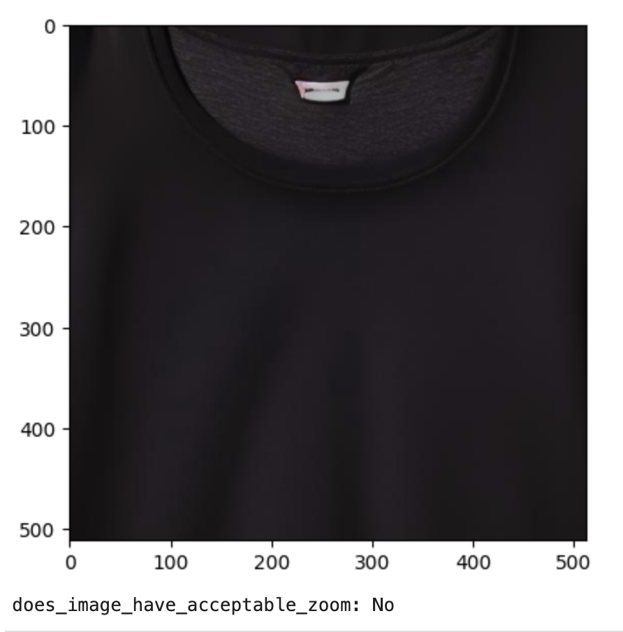
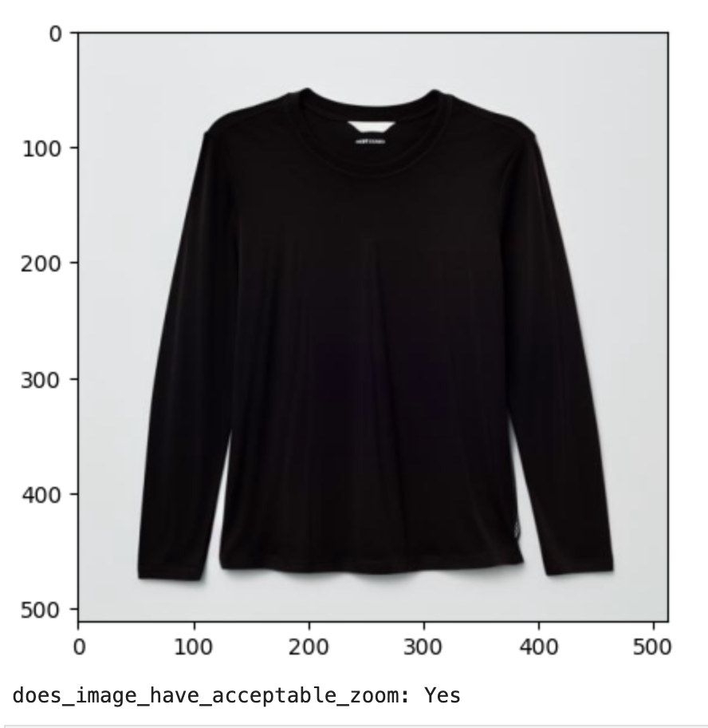
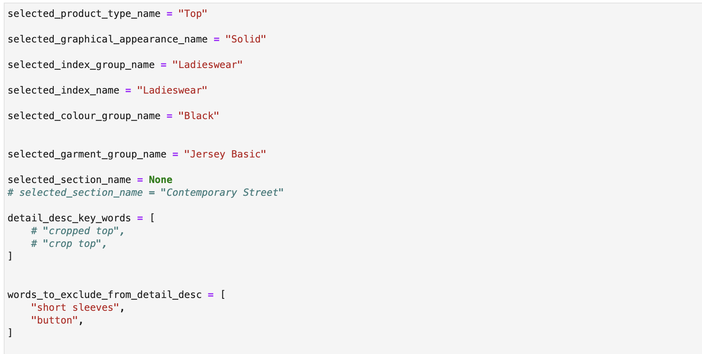
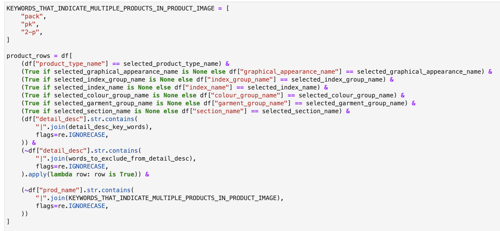
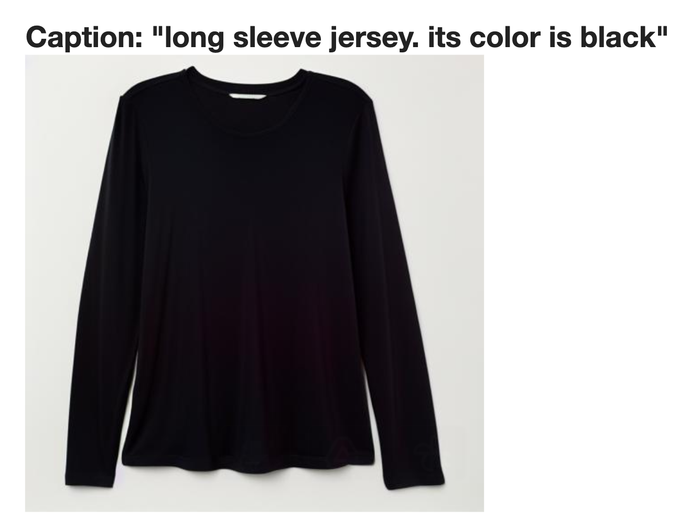
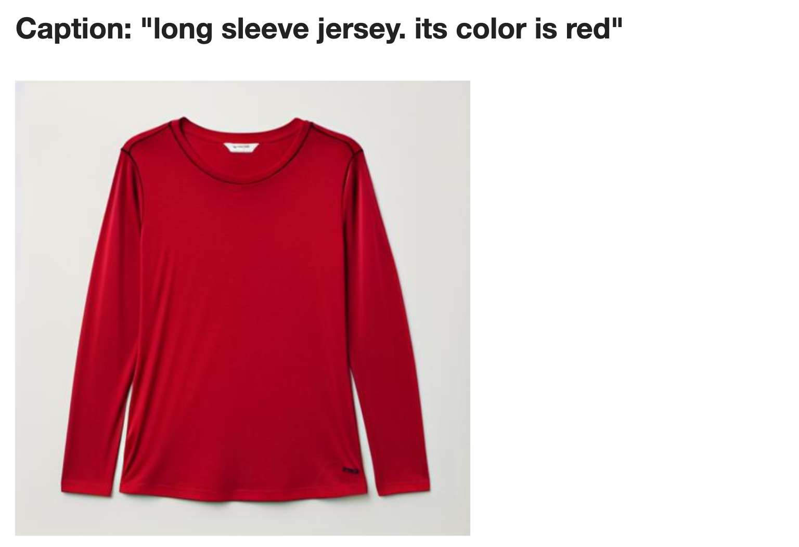
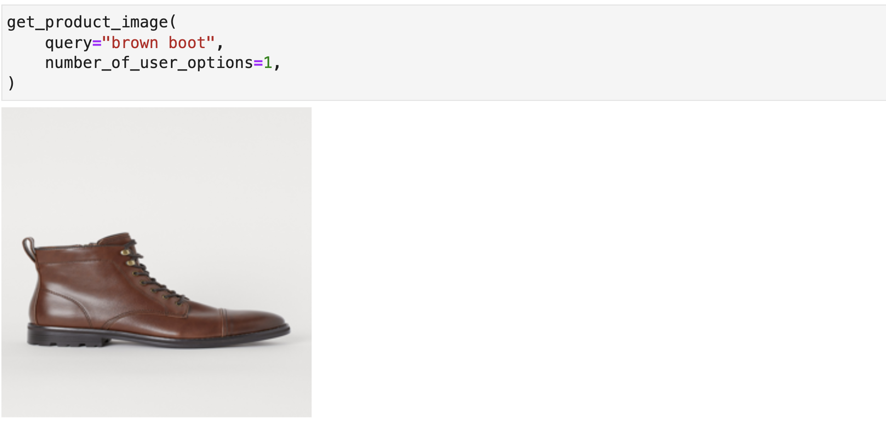
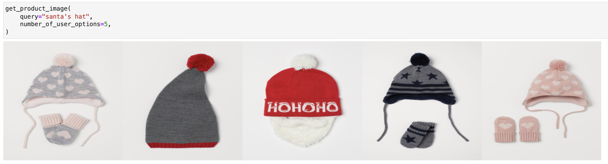

# Summary of Contents

   
### bad_zoom_detector.ipynb
The challenge requires a neutral background with the fashion product positioned at the center of the image.

This module detects images that violate this constraint.

#### Use
Multiple images can be generated in parallel from the inference module and this module can be used to filter improper images.

#### Examples

   
   

### data_exploration_and_generation.ipynb
This notebook is used to explore the dataset of the Kaggle Challenge. A subset of the data is selected to use for the challenge.

#### Examples

### train_lora_model.ipynb
The module trains a LoRA model using the dataset generated in the `data_exploration_and_generation` notebook.

#### Use
To limit scope, this training focused on products with the caption "long sleeve jersey. its color is black". It was however, able to generate an acceptable image, as shown below, with the caption "long sleeve jersey. its color is red".

#### Examples

   
   

### vector_search.ipynb
This module creates a shared embedding space for product images, product captions, and a user request. These embeddings are stored in a vector database (FAISS) for quick lookup.

#### Use
A user enters a request for a product (i.e. "a brown hiking boot"), the vector database (FAISS) then looks up the product images in our collection that best match the description. Perfectly consistent images are then returned to the user every time.

#### Examples

